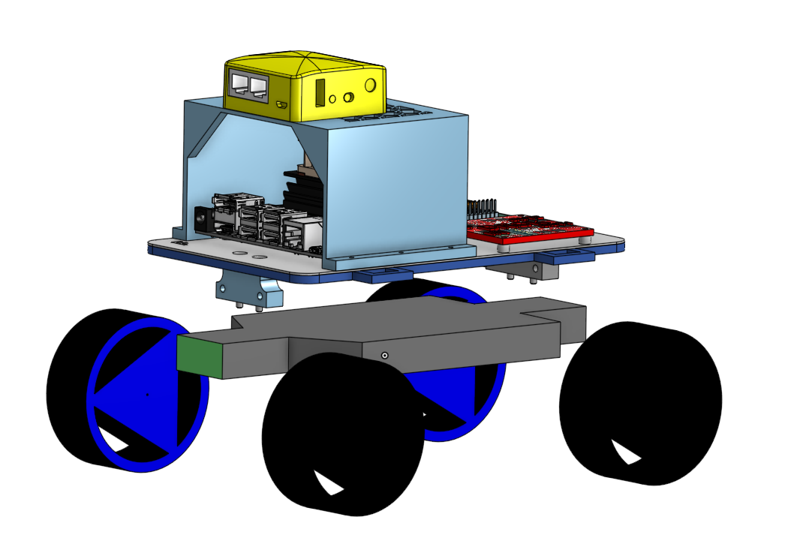
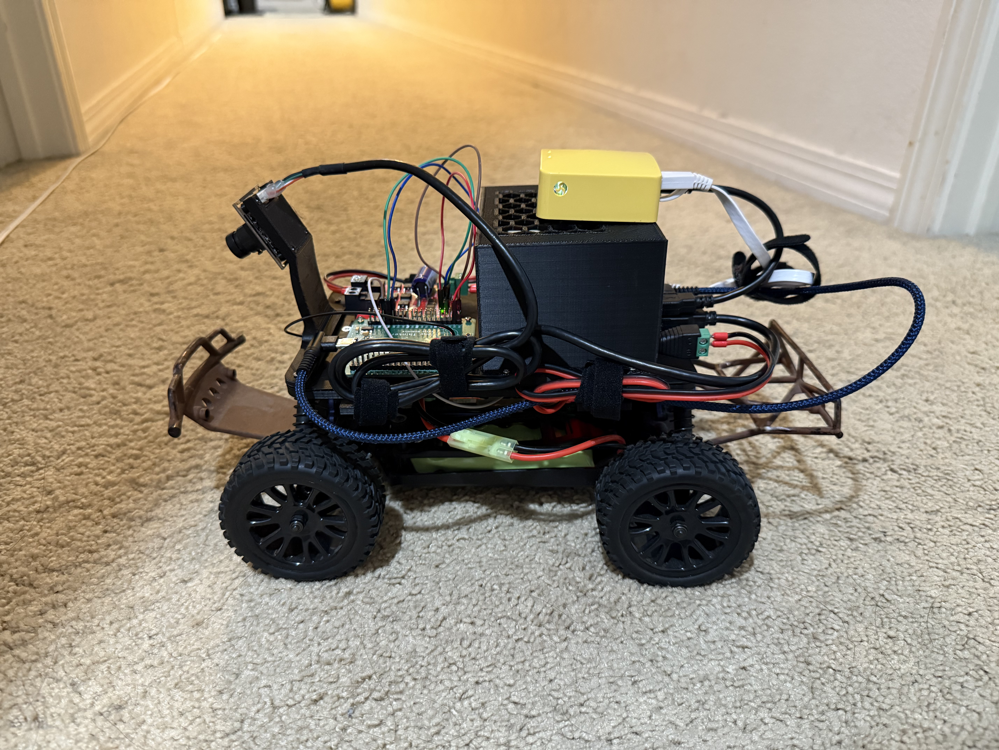
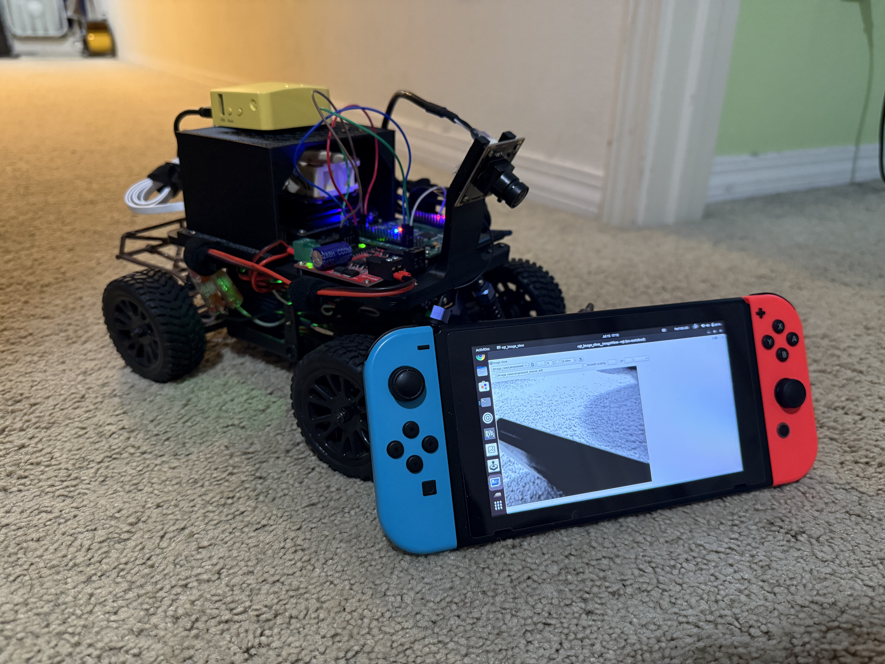
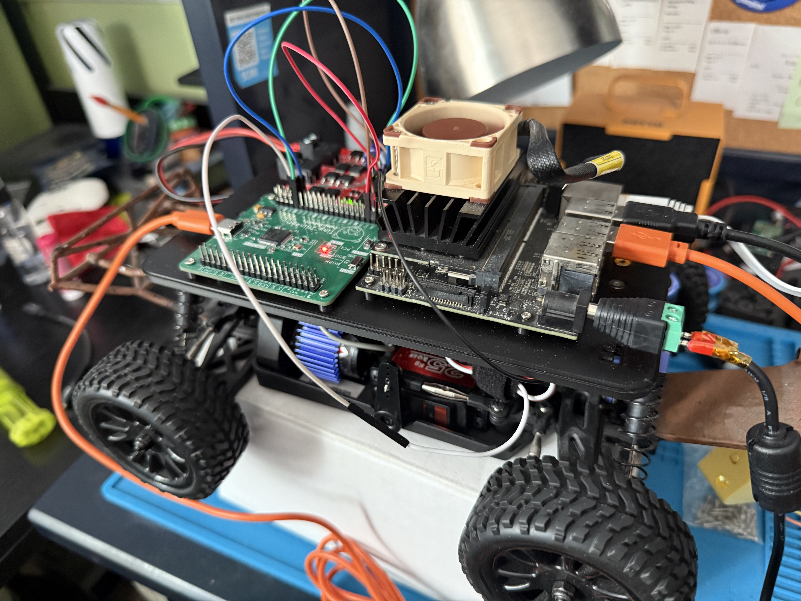

# Polar-One
Polar One is an RC Car running ROS 2 Jazzy as the main software for all subsystems. This project was initially for the Boeing High school internship but was worked on afterwards.

## Hardware
The base chassis of this car is the [Exceed RC 1/16 Legion Desert Monster Truck](https://www.nitrorcx.com/51c854-16-desertmonster-ddblue-24g.html), using a 25KG servo for steering and a brushed 380 motor controlled by an L298 Motor Driver. 

Components:
- NVIDIA Jetson Nano (4 GB)
- [AR0144 Global Shutter Camera](https://www.amazon.com/dp/B0C3M52K6X?lv=shuf&channelId=500&plpRedirect=mhFallback)
- [Tiny Thinker STM32 Board](https://github.com/awesomeyooner/Tiny-Thinker)
- [Mango Router](https://www.gl-inet.com/en-us/products/gl-mt300n-v2?srsltid=AfmBOoqTpiGF_bX42_W4qsnrI0p_AHjo5lqIbnSPYlNqghL_682rRaWU) for Access Point
- [DROK L298 Motor Driver](https://www.amazon.com/dp/B06XGD5SCB?ref=nb_sb_ss_w_as-reorder_k0_1_14&amp=&crid=1PV5BL7NTAXUQ&sprefix=drok%2Bmotor%2Bdri&th=1)
- [25KG Servo](https://www.amazon.com/dp/B0C5LWHTQ1?ref_=ppx_hzsearch_conn_dt_b_fed_asin_title_1&th=1)
- [DC-DC Buck Converter](https://www.amazon.com/dp/B085T73CSD?ref=ppx_yo2ov_dt_b_fed_asin_title)
- 1 7.2V NiMH battery

## Software
The Jetson Nano runs Jetpack 4.6 but uses `Docker` and `Ubuntu 24.04` for running `ROS 2 Jazzy`. The Dockerfile can be found [here](https://github.com/awesomeyooner/ROS-Docker) under `Base Image/arm`

The `Tiny Thinker` runs the low-level hardware control for the servo and motor driver and communicates with the Jetson over Serial. Code implementation can be found [here](https://github.com/awesomeyooner/CommiFaceLib)

## Pictures









## Setup

With the docker image built, do the following to set this project up on the Jetson Nano

First, setup the repository

```bash
$ git clone https://github.com/awesomeyooner/Polar-One.git && cd Polar-One
$ git submodule update --init --recursive
```

Then build the ros2_ws

```bash
$ cd /path/to/Polar-One/service
$ ./terminal.sh

# You should now be in the docker container
$ cd ros2_ws && colcon build --symlink-install
$ exit
```

Then just add the `.service` file

```bash
$ cd /path/to/Polar-One/service
$ ./setup.bash
```